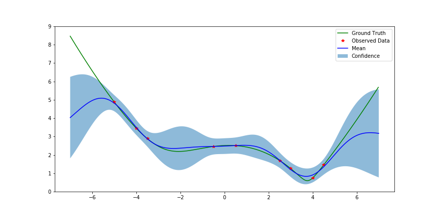
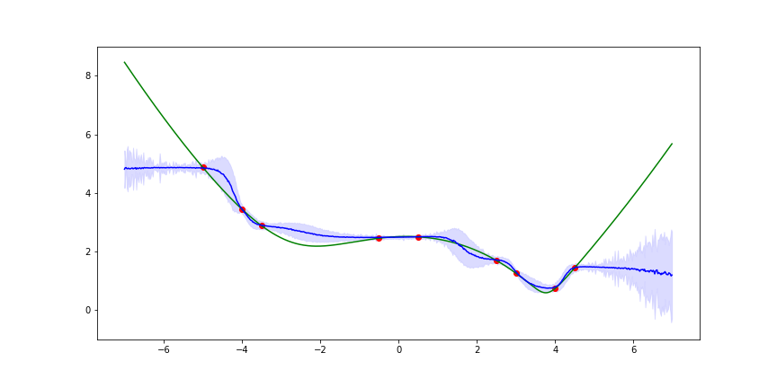
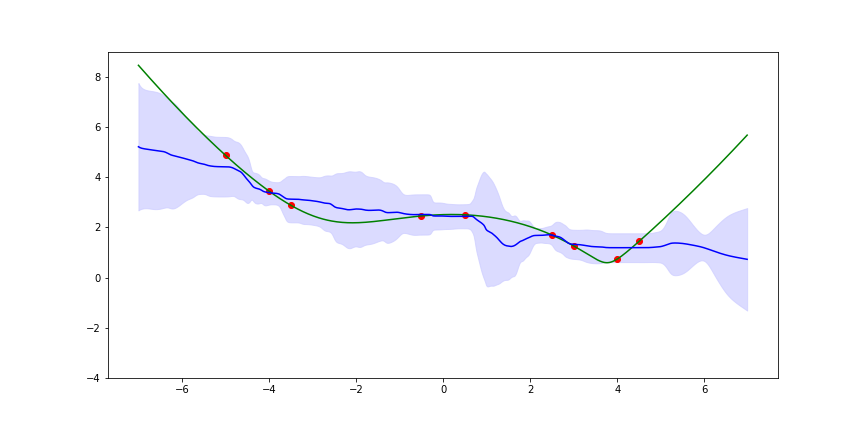

# Quantifying Uncertainty in Neural Networks

This code supports my talk at the Robust AI meetup in Seattle on 20 Nov, 2019.

The talk describes several methods of estimating the confidence/uncertainty coming
out of a neural network, and compares them with a toy regression problem.

The three methods are all trained incrementally on a toy regression problem.  The final results for each are here for a quick comparison.

### Gaussian Processes

### Monte Carlo Dropout 
[Gal, Ghahramani 2015](https://arxiv.org/abs/1506.02142)

### Deep Ensembles
[Lakshminarayanan 2016](https://arxiv.org/abs/1612.01474)

